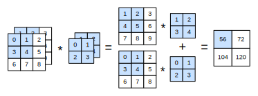
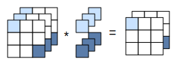

# 多输入和输出通道

前面小节里我们用到的输入和输出都是二维矩阵。但实际使用中我们的数据的维度经常更高。例如如果使用彩色图片作为输出，它可能有RGB这三个通道。假设它的高和宽分别是$h$和$w$，那么内存中它可能会被表示成一个$3\times h\times w$的多维数组。我们将大小为3的这一维称之为通道（channel）。这一节我们将介绍输入和输出都是多通道的二维卷积层。

## 多输入通道

当输入通道数是$c_i$，且使用$k_h\times k_w$形状的核时，我们将会为每个输入通道分配一个单独的$k_h\times k_w$形状的核参数。所以卷积层的核参数的形状将会是$c_i\times k_h\times k_w$。下图展示了当输入通道是2的时候的情况。可以看到我们在每个通道里对各自的输入矩阵和核矩阵做相关计算，然后再将通道之间的结果相加得到最终结果。



下面我们来实现它的计算。首先我们将前面小节实现的`corr2d`复制过来。

```{.python .input  n=2}
from mxnet import nd, autograd
from mxnet.gluon import nn

def corr2d(X, K):
    n, m = K.shape
    Y = nd.zeros((X.shape[0]-n+1, X.shape[1]-m+1))
    for i in range(Y.shape[0]):
        for j in range(Y.shape[1]):
            Y[i, j] = (X[i:i+n, j:j+m]*K).sum()
    return Y
```

为了实现多输入通道的版本，我们只需要对每个通道做相关计算，然后通过`nd.add_n`来进行累加。

```{.python .input  n=14}
def corr2d_multi_in(X, K):
    # 我们首先沿着 X 和 K 的第 0 维（通道维）遍历。然后使用 * 将结果列表 (list) 变成
    # add_n 的位置参数（positional argument）来进行相加。
    return nd.add_n(*[corr2d(x, k) for x, k in zip(X, K)])
```

下面构造出上图的输入和核，然后验证结果的正确性。

```{.python .input  n=33}
X = nd.array([[[0,1,2], [3,4,5], [6,7,8]], 
              [[1,2,3], [4,5,6], [7,8,9]]])
K = nd.array([[[0,1], [2,3]], [[1,2], [3,4]]])

corr2d_multi_in(X, K)
```

## 多输出通道

由于我们对输入通道的结果做了累加，因此不论输入数据通道数的大小是多少，输入通道总是为1。如果我们想得到$c_o$通道数的输入，我们可以创建$c_o$个$c_i\times k_h\times k_w$小大的核参数，然后每个核参数与输入做相关计算来得到输出的一个通道。这样，卷积层核的形状将是$c_o\times c_i\times k_h\times k_w$。多输出通道的实现见下面代码。

```{.python .input  n=30}
def corr2d_multi_in_out(X, K):
    # 对 K 的第 0 维遍历，每次同输入 X 做相关计算。所有结果使用 nd.stack 合并在一起。
    return nd.stack(*[corr2d_multi_in(X, k) for k in K])
```

我们将三维的`K`，`K+1`和`K+2`拼在一起来构造一个输出通道为3的核参数，它将是一个四维数组。

```{.python .input  n=34}
K = nd.stack(K, K+1, K+2)
K.shape
```

计算结果后验证我们输出有三个通道，其中第一个通道跟上例中输出一致。

```{.python .input  n=35}
corr2d_multi_in_out(X, K)
```

## $1\times 1$卷积层

最后我们讨论一下使用$1\times 1$形状核（$k_h=k_w=1$）的特殊卷基层。它失去了卷基层可以识别相邻元素构成的模式的功能（例如回忆之前介绍的图片边缘识别），但仍然经常使用。

下图展示了输入通道为3和输出通道为2的情况。输出里的每个元素来自输入对应位置的元素在不同通道之间的按权重累加。这个情况下，它等价于一个输入大小为2和输出大小为3的全连接层。



下面代码我们直接使用矩阵乘法来来实现$1\times 1$卷积层。可以看到，这里的通道对应全连接的特征，而宽和高里的元素则对应之前的数据点。

```{.python .input}
def corr2d_multi_in_out_1x1(X, K):
    c_i, h, w = X.shape
    c_o = K.shape[0]
    X = X.reshape((c_i, h*w))
    K = K.reshape((c_o, c_i))
    Y = nd.dot(K, X)
    return Y.reshape((c_o, h, w))
```

生成一组随机数来验证我们这个实现的正确性。

```{.python .input}
X = nd.random.uniform(shape=(3,3,3))
K = nd.random.uniform(shape=(2,3,1,1))

Y1 = corr2d_multi_in_out_1x1(X, K)
Y2 = corr2d_multi_in_out(X, K)
(Y1-Y2).norm().asscalar() < 1e-6
```

可以看到$1\times 1$卷积层虽然失去了识别空间模式的功能，但它能够混合输在不同通道之间的信息，因此被经常使用在调整网络的层之间的通道数，从而控制模型复杂度。

## 小节

- 使用多通道可以极大拓展卷基层的模型参数。
- $1\times 1$卷积层通常用来调节通道数。

## 练习

- 假设输入大小为$c_i\times h\times w$，我们使用$c_o\times c_i\times k_h\times k_w$的核，而且使用$(p_h, p_w)$填充和$(s_h, s_w)$步幅，那么这个卷积层的前向计算需要多少次乘法，多少次加法？
- 翻倍输入通道$c_i$和输出通道$c_o$会增加多少倍计算？翻倍填充呢？
- 如果使用$k_h=k_w=1$，能减低多少倍计算？
- `Y1`和`Y2`结果完全一致吗？原因是什么？
