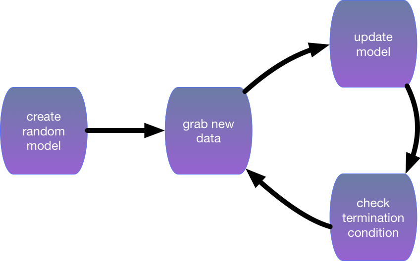
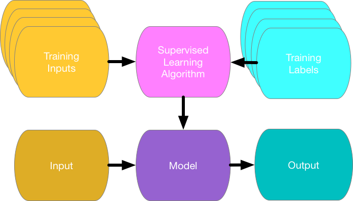
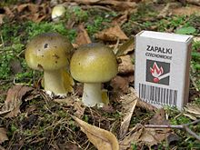
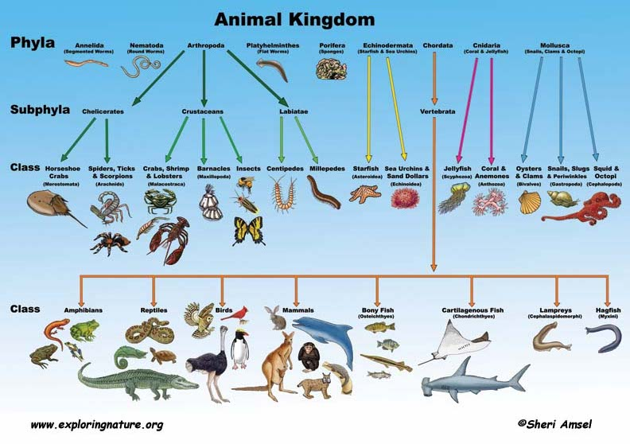
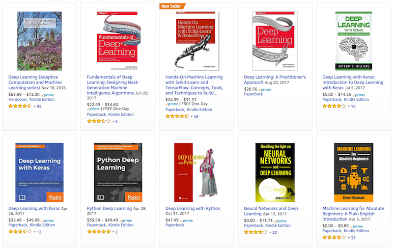
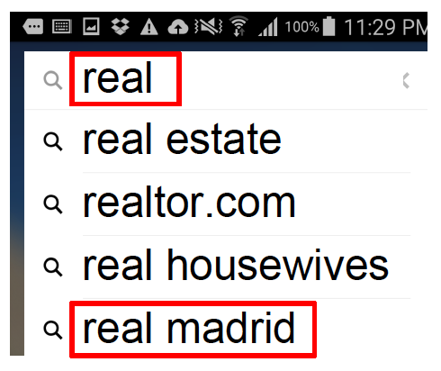
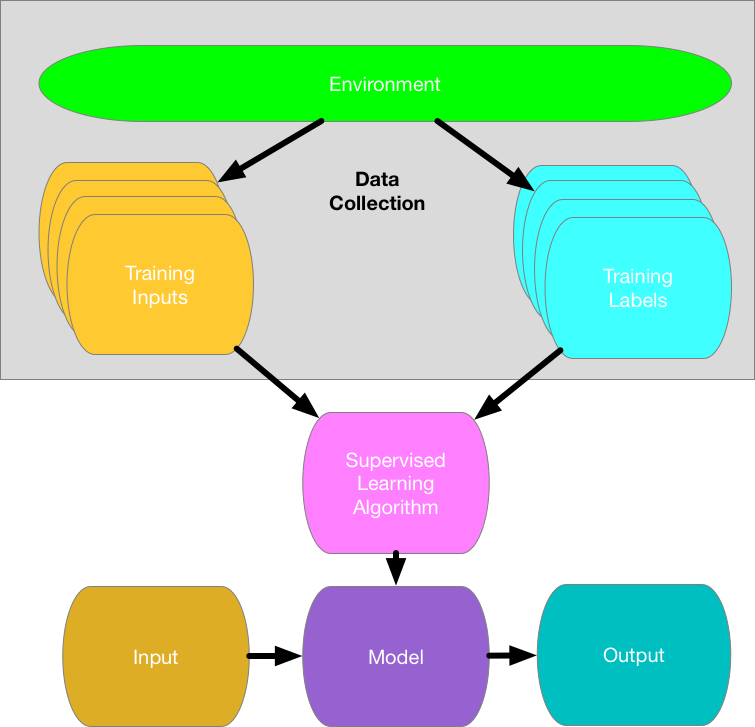
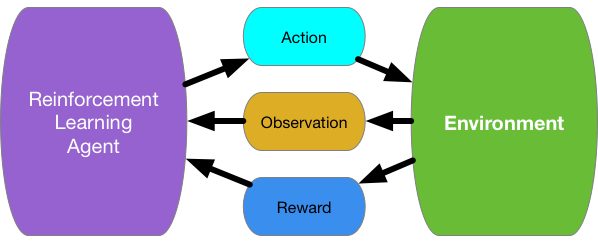

# 机器学习简介

本书作者跟广大程序员一样，在开始写作前需要来一杯咖啡。我们跳进车准备出发，Alex掏出他的安卓喊一声“OK Google”唤醒语言助手，Mu操着他的中式英语命令到“去蓝瓶咖啡店”。手机快速识别并显示出命令，同时判断我们需要导航，并调出地图应用，给出数条路线方案，每条方案均有预估的到达时间并自动选择最快的线路。好吧，这是一个虚构的例子，因为我们一般在办公室喝自己的手磨咖啡。但这个例子展示了在短短几秒钟里，我们跟数个机器学习模型进行了交互。

如果你从来没有使用过机器学习，你会想，“这不就是编程吗？”或者，“**机器学习（machine learning）** 到底是什么？”首先，我们确实是使用编程语言来实现机器学习模型，我们跟计算机其他领域一样，使用同样的编程语言和硬件。但不是每个程序都涉及机器学习。对于第二个问题，精确定义机器学习就像定义什么是数学一样难，但我们试图在这章提供一些直观的解释。

## 一个例子

我们日常交互的大部分计算机程序，都可以使用最基本的命令来实现。当你把一个商品加进购物车时，你触发了电商的电子商务程序，把一个商品ID和你的用户ID插入一个叫做购物车的数据库表格中。你可以在没有见到任何真正客户前，用最基本的程序指令来实现这个功能。如果你发现可以这么做，那么这时就**不需要使用机器学习**。

对于机器学习科学家来说，幸运的是大部分应用没有那么简单。回到前面那个例子，想象下如何写一个程序来回应**唤醒词**，例如“Okay, Google”，“Siri”，和“Alexa”。如果在一个只有你自己和代码编辑器的房间里，仅使用最基本的指令编写这个程序，你该怎么做？不妨思考一下……这个问题非常困难。你可能会想像下面的程序：

```{.python .input}
if input_command == 'Okey, Google':
     run_voice_assistant()
```

但实际上，你能拿到的只有麦克风里采集到的原始语音信号，可能是每秒44,000个样本点。怎样的规则才能把这些样本点转成一个字符串呢？或者简单点，判断这些信号中是否包含唤醒词。


如果你被这个问题难住了，不用担心。这就是我们为什么需要机器学习。

虽然我们不知道怎么告诉机器去把语音信号转成对应的字符串，但我们自己可以。换句话说，就算你不清楚怎么编写程序，好让机器识别出唤醒词“Alexa”，你自己完全**能够** 识别出“Alexa”这个词。由此，我们可以收集一个巨大的**数据集（data set）**，里面包含了大量语音信号，以及每个语音型号**是否** 对应我们需要的唤醒词。使用机器学习的解决方式，我们并非直接设计一个系统去**准确地** 辨别唤醒词，而是写一个灵活的程序，并带有大量的**参数（parameters）**。通过调整这些参数，我们能够改变程序的行为。我们将这样的程序称为模型（models）。总体上看，我们的模型仅仅是一个机器，通过某种方式，将输入转换为输出。在上面的例子中，这个模型的**输入（input）** 是一段语音信号，它的输出则是一个回答`{yes, no}`，告诉我们这段语音信号是否包含了唤醒词。

如果我们选择了正确的模型，必然有一组参数设定，每当它听见“Alexa”时，都能触发`yes`的回答；也会有另一组参数，针对“Apricot”触发`yes`。我们希望这个模型既可以辨别“Alexa”，也可以辨别“Apricot”，因为它们是类似的任务。不过，如果是本质上完全不同的输入和输出，比如输入图片，输出文本；或者输入英文，输出中文，这时我们则需要另一个的模型来完成这些转换。

这时候你大概能猜到了，如果我们随机地设定这些参数，模型可能无法辨别“Alexa”，“Apricot”，甚至任何英文单词。在而大多数的深度学习中，**学习（learning）** 就是指在**训练过程（training period）** 中更新模型的行为（通过调整参数）。

换言之，我们需要用数据训练机器学习模型，其过程通常如下：

1. 初始化一个几乎什么也不能做的模型；
2. 抓一些有标注的数据集（例如音频段落及其是否为唤醒词的标注）；
3. 修改模型使得它在抓取的数据集上能够更准确执行任务（例如使得它在判断这些抓取的音频段落是否为唤醒词上判断更准确）；
4. 重复以上步骤2和3，直到模型看起来不错。



总而言之，我们并非直接去写一个唤醒词辨别器，而是一个程序，当**提供一个巨大的有标注的数据集** 时，它能**学习** 如何辨别唤醒词。你可以认为这种方式是**利用数据编程**。

如果给我们的机器学习系统提供足够多猫和狗的图片，我们可以“编写”一个喵星人辨别器：

|  |  |  |  |
|:---------------:|:---------------:|:---------------:|:---------------:|
| 喵 | 喵 | 汪 | 汪 |

如果是一只猫，辨别器会给出一个非常大的正数；如果是一只狗，会给出一个非常大的负数；如果不能确定的话，数字则接近于零。这仅仅是一个机器学习应用的粗浅例子。

## 眼花缭乱的机器学习应用

机器学习背后的核心思想是，设计程序使得它可以在执行的时候提升它在某任务上的能力，而非直接编写程序的固定行为。机器学习包括多种问题的定义，提供很多不同的算法，能解决不同领域的各种问题。我们之前讲到的是一个讲**监督学习（supervised learning ）** 应用到语言识别的例子。

正因为机器学习提供多种工具，可以利用数据来解决简单规则无法或者难以解决的问题，它被广泛应用在了搜索引擎、无人驾驶、机器翻译、医疗诊断、垃圾邮件过滤、玩游戏（国际象棋、围棋）、人脸识别、数据匹配、信用评级和给图片加滤镜等任务中。

虽然这些问题各式各样，但他们有着共同的模式，都可以使用机器学习模型解决。我们无法直接编程解决这些问题，但我们能够使用配合数据编程来解决。最常见的描述这些问题的方法是通过数学，但不像其他机器学习和神经网络的书那样，我们会主要关注真实数据和代码。下面我们来看点数据和代码。

## 用代码编程和用数据编程

这个例子灵感来自 [Joel Grus](http://joelgrus.com) 的一次 [应聘面试](http://joelgrus.com/2016/05/23/fizz-buzz-in-tensorflow/). 面试官让他写个程序来玩Fizz Buzz. 这是一个小孩子游戏。玩家从1数到100，如果数字被3整除，那么喊'fizz'，如果被5整除就喊'buzz'，如果两个都满足就喊'fizzbuzz'，不然就直接说数字。这个游戏玩起来就像是：

> 1 2 fizz 4 buzz fizz 7 8 fizz buzz 11 fizz 13 14 fizzbuzz 16 ...

传统的实现是这样的：

```{.python .input}
res = []
for i in range(1, 101):
    if i % 15 == 0:
        res.append('fizzbuzz')
    elif i % 3 == 0:
        res.append('fizz')
    elif i % 5 == 0:
        res.append('buzz')
    else:
        res.append(str(i))
print(' '.join(res))
```

对于经验丰富的程序员来说这个太不够一颗赛艇了。所以Joel尝试用机器学习来实现这个。为了让程序能学，他需要准备下面这个数据集：

* 数据 X ``[1, 2, 3, 4, ...]`` 和标注Y ``['fizz', 'buzz', 'fizzbuzz', identity]``
* 训练数据，也就是系统输入输出的实例。例如 ``[(2, 2), (6, fizz), (15, fizzbuzz), (23, 23), (40, buzz)]``
* 从输入数据中抽取的特征，例如 ``x -> [(x % 3), (x % 5), (x % 15)]``.

有了这些，Jeol利用TensorFlow写了一个[分类器](https://github.com/joelgrus/fizz-buzz-tensorflow)。对于不按常理出牌的Jeol，面试官一脸黑线。而且这个分类器不是总是对的。

显而易见，这么解决问题蠢爆了。为什么要用复杂和容易出错的东西替代几行Python呢？但是，很多情况下，这么一个简单的Python脚本并不存在，而一个三岁小孩就能完美地解决问题。这时候，机器学习就该上场了。

## 机器学习最简要素

针对识别唤醒语的任务，我们将语音片段和标注（label）放在一起组成数据集。接着我们训练一个机器学习模型，给定一段语音，预测它的标注。这种给定样例预测标注的方式，仅仅是机器学习的一种，称为**监督学习**。深度学习包含很多不同的方法，我们会在后面的章节讨论。成功的机器学习有四个要素：数据、转换数据的模型、衡量模型好坏的损失函数和一个调整模型权重来最小化损失函数的算法。

### 数据（Data）

越多越好。事实上，数据是深度学习复兴的核心，因为复杂的非线性模型比其他机器学习需要更多的数据。数据的例子包括：

  - **图片**：你的手机图片，里面可能包含猫、狗、恐龙、高中同学聚会或者昨天的晚饭；卫星照片；医疗图片例如超声、CT扫描以及MRI等等。
  - **文本**：邮件、高中作文、微博、新闻、医嘱、书籍、翻译语料库和微信聊天记录。
  - **声音**：发送给智能设备（比如Amazon Echo，iPhone或安卓智能机）的声控指令、有声书籍、电话记录、音乐录音，等等。
  - **影像**：电视节目和电影，Youtube 视频，手机短视频，家用监控，多摄像头监控等等。
  - **结构化数据**：Jupyter notebook（里面有文本，图片和代码）、网页、电子病历、租车记录和电费账单。

### 模型（Models）

通常，我们拿到的数据和最终想要的结果相差甚远。例如，想知道照片中的人是不是开心，我们希望有一个模型，能将成千上万的低级特征（像素值），转化为高度抽象的输出（开心程度）。选择正确模型并不简单，不同的模型适合不同的数据集。在这本书中，我们会主要聚焦于深度神经网络模型。这些模型包含了自上而下联结的数据多层连续变换，因此称之为**深度学习（deep learning）** 。在讨论深度神经网络之前，我们也会讨论一些简单、浅显的模型。

### 损失函数（Loss Functions）

我们需要对比模型的输出和真实值之间的误差。损失函数可以衡量输出结果对比真实数据的好坏。例如，我们训练了一个基于图片预测病人心率的模型。如果模型预测某个病人的心率是100bpm，而实际上仅有60bpm，这时候，我们就需要某个方法来提点一下这个的模型了。

类似的，一个模型通过给电子邮件打分来预测是不是垃圾邮件，我们同样需要某个方法判断模型的结果是否准确。典型的机器学习过程包括将损失函数最小化。通常，模型包含很多参数。我们通过最小化损失函数来“学习”这些参数。可惜，将损失降到最小，并不能保证我们的模型在遇到（未见过的）测试数据时表现良好。由此，我们需要跟踪两项数据：

  - **训练误差（training error）**：这是模型在用于训练的数据集上的误差。类似于考试前我们在模拟试卷上拿到的分数。有一定的指向性，但不一定保证真实考试分数。
  - **测试误差（test error）**：这是模型在没见过的新数据上的误差，可能会跟训练误差很不一样（统计上称之为过拟合）。类似于考前模考次次拿高分，但实际考起来却失误了。（笔者之一曾经做GRE真题时次次拿高分，高兴之下背了一遍红宝书就真上阵考试了，结果最终拿了一个刚刚够用的低分。后来意识到这是因为红宝书里包含了大量的真题。）

### 优化算法(Optimization Algorithms)

最后，我们需要算法来通盘考虑模型本身和损失函数，对参数进行搜索，从而逐渐最小化损失。最常见的神经网络优化使用梯度下降法作为优化算法。简单地说，轻微地改动参数，观察训练集的损失将如何移动。然后将参数向减小损失的方向调整。

下面我们详细讨论一些不同的机器学习应用，以便理解我们具体会做什么。每个例子，我们都会介绍问题的解决方式，如训练方式、数据类型等等。这些内容仅仅是开胃小菜，并为大家提供一些共同的谈资。随着学习的推进，我们会介绍更多的类似问题。

## 监督学习（Supervised Learning）

监督学习描述的任务是，当给定输入 $x$，如何通过在有标注输入和输出的数据上训练模型而能够预测输出 $y$。从统计角度来说，监督学习主要关注如何估计条件概率 $P(y|x)$。监督学习仅仅是机器学习的方法之一，在实际情景中却最为常用。部分原因，许多重要任务都可以描述为给定数据，预测结果。例如，给定一位患者的CT图像，预测该患者是否得癌症；给定英文句子，预测它的正确中文翻译；给定本月公司财报数据，预测下个月该公司股票价格。

“根据输入预测结果”，看上去简单，监督学习的形式却十分多样，其模型的选择也至关重要，数据类型、大小、输入和输出的体量都会产生影响。例如，针对序列型数据（文本字符串或时间序列数据）和固定长度的矢量表达，这两种不同的输入，会采用不同的模型。我们会在本书的前9章逐一介绍这些问题。

简单概括，学习过程看起来是这样的：在一大组数据中随机地选择样本输入，并获得其真实（ground-truth）的**标注（label）**；这些输入和标注（即期望的结果）构成了**训练集（training set）**。我们把训练集放入一个**监督学习算法（supervised learning algorithm）**。算法的输入是训练集，输出则是**学得模型（learned model）**。基于这个学得模型，我们输入之前未见过的测试数据，并预测相应的标注。



### 回归分析（Regression）

回归分析也许是监督学习里最简单的一类任务。在该项任务里，输入是任意离散或连续的、单一或多个的变量，而输出是连续的数值。例如我们可以把本月公司财报数据抽取出若干特征，如营收总额、支出总额以及是否有负面报道，利用回归分析预测下个月该公司股票价格。

一个更详细的例子，一个房屋的销售的数据集。构建一张表：每一行对应一幢房子；每一列对应一个属性，譬如面积、卧室数量、卫生间数量、与市中心的距离；我们将这个数据集里这样的一行，称作一个**特征向量（feature vector）**，它所代表的对象（比如一幢房子），称作**样例（example）**。

如果住在纽约或三藩这种大城市，你也不是某个知名科技公司CEO，那么这个特征向量（面积、卧室数量、卫生间数量、与市中心的距离）可能是这样的$[100, 0, .5, 60]$。如果住在匹兹堡，则可能是这样的$[3000, 4, 3, 10]$。这些特征向量，是所有经典机器学习问题的关键。我们一般将一个特征向量标为 $\mathbf{x_i}$，将所有特征向量的集合标为 $X$。

一个问题是否应采用回归分析，取决于它的输出。比如你想预测一幢房子的合理的市场价格，并提供了类似的特征向量。它的目标市场价是一个**实数**。我们将单个目标（对应每一个特征向量代表的样例 $\mathbf{x_i}$ 标为 $y_i$，所有目标的集合为 $\mathbf{y}$（对应所有样例的集合 $X$）。当我们的目标是某个范围内的任意实数值时，这就是一个回归分析问题。模型的目标就是输出预测（在这个例子中，即价格的预测），且尽可能近似实际的目标值。我们将这些预测标为 $\hat{y}_i$；如果这堆符号看起来费解，不用担心，在接下来的章节中我们会详细讲解。

许多实际问题都是充分描述的回归问题。比如预测观众给某部电影的打分；如果2009年时你设计出一个这样一个算法，[Netflix的一百万大奖](https://en.wikipedia.org/wiki/Netflix_Prize)就是你的了；预测病人会在医院停留的时间也是一个回归问题。一条经验就是，问题中如果包含“**多少？**”，这类问题一般是回归问题。**“这次手术需要几个小时？”**……回归分析。**“这张照片里有几只狗？”**……回归分析。不过，如果问题能够转化为“这是一个____吗？”，那这很有可能是一个分类，或者属于其余我们将会谈及的问题。

如果我们把模型预测的输出值和真实的输出值之间的差别定义为残差，常见的回归分析的损失函数包括训练数据的残差的平方和或者绝对值的和。机器学习的任务是找到一组模型参数使得损失函数最小化。我们会在之后的章节里详细介绍回归分析。

### 分类（Classification）

回归分析能够很好地解答“**多少？**”的问题，但还有许多问题并不能套用这个模板。比如，银行手机App上的支票存入功能，用户用手机拍摄支票照片，然后，机器学习模型需要能够自动辨别照片中的文字。包括某些手写支票上龙飞凤舞的字体。这类的系统通常被称作光学字符识别（OCR），解决方法则是分类。较之回归分析，它的算法需要对离散集进行处理。

回归分析所关注的预测可以解答输出为**连续数值** 的问题。当预测的输出是**离散的** 类别时，这个监督学习任务就叫做分类。分类在我们日常生活中很常见。例如我们可以把本月公司财报数据抽取出若干特征，如营收总额、支出总额以及是否有负面报道，利用分类预测下个月该公司的CEO是否会离职。在计算机视觉领域，把一张图片识别成众多物品类别中的某一类，例如猫、狗等。

在分类问题中，我们的特征向量，例如，图片中的一个像素值，然后，预测它在一组可能值中所属的分类（一般称作**类别（class）**）。对于手写数字来说，我们有数字1~10这10个类别，最简单的分类问题莫过于二分类（binary classification），即仅仅有两个类别的分类问题。例如，我们的数据集 $X$ 是含有动物的图片，标注 $Y$ 是类别 $\mathrm{\{cat, dog\}}$。在回归分析里，输出是一个实数 $\hat{y}$ 值。而在分类中，我们构建一个**分类器（classifier）**，其最终的输出 $\hat{y}$ 是预测的类别。

随着本书在技术上的逐渐深入，我们会发现，训练一个能够输出绝对分类的模型，譬如“不是猫就是狗”，是很困难的。简单一点的做法是，我们使用概率描述它。例如，针对一个样例 $x$，模型会输出每一类标注 $k$ 的一个概率 $\hat{y}_k$。因为是概率，其值必然为正，且和为 $1$。换句话说，总共有 $K$ 个类别的分类问题，我们只需要知道其中 $K-1$ 个类别的概率，自然就能知道剩下那个类别的概率。这个办法针对二分类问题尤其管用，如果抛一枚不均匀的硬币有0.6(60%)的概率正面朝上，那么，反面朝上的概率就是0.4(40%)。回到我们的喵汪分类，一个分类器看到了一张图片，输出图上的动物是猫的概率 $\Pr(y=\mathrm{cat}\mid x) = 0.9$。对于这个结果，我们可以表述成，分类器 90% 确信图片描绘了一只猫。预测所得的类别的概率大小，仅仅是一个确信度的概念。我们会在后面的章节中进一步讨论有关确信度的问题。

多于两种可能类别的问题称为多分类。常见的例子有手写字符识别`[0, 1, 2, 3 ... 9, a, b, c, ...]`。分类问题的损失函数称为**交叉熵（cross-entropy）** 损失函数。可以在`MXNet Gluon`中[找到](http://mxnet.io/api/python/gluon.html#mxnet.gluon.loss.SoftmaxCrossEntropyLoss)。

请注意，预测结果并不能左右最终的决策。比如，你在院子里发现了这个萌萌的蘑菇：



假定我们训练了一个分类器，输入图片，判断图片上的蘑菇是否有毒。这个“是否有毒分类器”输出了 $\Pr(y=\mathrm{death cap}\mid\mathrm{image}) = 0.2$。换句话说，这个分类器 80% 确信这个蘑菇不是入口即挂的毒鹅膏。但我们不会蠢到去吃它。这点口腹之欲不值得去冒 20% 挂掉的风险。不确定的风险远远超过了收益。数学上，最最基本的，我们需要算一下预期风险，即，把结果概率与相应的收益（或损失）相乘：

$$L(\mathrm{action}\mid x) = \mathbf{E}_{y \sim p(y\mid x)}[\mathrm{loss}(\mathrm{action},y)]$$

很走运：正如任何真菌学家都会告诉我们的，上图真的就是一个毒鹅膏。实际上，分类问题可能比二分类、多分类、甚至多标签分类要复杂得多。例如，分类问题的一个变体，**层次分类（hierarchical classification）**。层次假设各个类别之间或多或少地存在某种关系。并非所有的错误都同等严重 —— 错误地归入相近的类别，比距离更远的类别要好得多。一个早期的例子来自[卡尔·林奈](https://en.wikipedia.org/wiki/Carl_Linnaeus)，他发明了沿用至今的物种分类法。



在动物分类的中，将贵宾犬误认为雪纳瑞并不是很严重的错误，但把贵宾犬和恐龙混淆就是另一回事了。但是，什么结构是合适的，取决于模型的使用。例如，响尾蛇和束带蛇在演化树上可能很近，但是把一条有毒的响尾蛇认成无毒的束带蛇可是致命的。

### 标注（Tagging）

事实上，有一些看似分类的问题在实际中却难以归于分类。例如，把下面这张图无论分类成猫还是狗看上去都有些问题。


正如你所见，上图里既有猫又有狗。其实还没完呢，里面还有草啊、轮胎啊、石头啊等等。与其将上图仅仅分类为其中一类，倒不如把这张图里面我们所关心的类别都标注出来。比如，给定一张图片，我们希望知道里面是否有猫、是否有狗、是否有草等。给定一个输入，输出不定量的类别，这个就叫做标注任务。

这类任务预测**非互斥分类** 的任务，叫做多标签分类。想象一下，人们可能会把多个标签同时标注在自己的某篇技术类博客文章上，例如“机器学习”、“科技”、“编程语言”、“云计算”、“安全与隐私”和“AWS”。这里面的标签其实有时候相互关联，比如“云计算”和“安全与隐私”。当一篇文章可能被标注的数量很大时，人力标注就显得很吃力。这就需要使用机器学习了。

生物医学领域也有这个问题，正确地标注研究文献能让研究人员对文献进行彻底的审阅。在美国国家医学图书馆，一些专业的文章标注者会浏览PubMed中索引的每篇文章，并与MeSH，一个大约28k个标签的集合中的术语相关联。这是一个漫长的过程，通常在文章归档一年后才会轮到标注。在手动审阅和标注之前，机器学习可以用来提供临时标签。事实上，近几年，BioASQ组织已经举办过相关[比赛](http://bioasq.org/)。

### 搜索与排序（Search and Ranking）

在信息检索领域，我们常常需要进行排序。以网络搜索为例，相较于判断页面是否与检索条目有关，我们更倾向于判断在浩如烟海的搜索结果中，应向用户显示哪个结果。这就要求我们的算法，能从较大的集合中生成一个有序子集。换句话说，如果要求生成字母表中的前5个字母，返回`A B C D E`和`C A B E D`是完全不同的。哪怕集合中的元素还是这些，但元素的顺序意义重大。

一个可行的解决方案，是用相关性分数对集合中的每个元素进行评分，并检索得分最高的元素。互联网时代早期有一个著名的网页排序算法叫做[PageRank](https://en.wikipedia.org/wiki/PageRank)，就使用了这种方法。该算法的排序结果并不取决于用户检索条目，而是对包含检索条目的结果进行排序。现在的搜索引擎使用机器学习和行为模型来获得检索的相关性分数。有不少专门讨论这个问题的会议。

### 推荐系统（Recommender Systems）

推荐系统与搜索排序关系紧密，其目的都是向用户展示一组相关条目。主要区别在于，推荐系统特别强调每个用户的**个性化** 需求。例如电影推荐，科幻电影粉和伍迪·艾伦喜剧爱好者的页面可能天差地别。

推荐系统被广泛应用于购物网站、搜索引擎、新闻门户网站等等。有时，客户会详细地表达对产品的喜爱（例如亚马逊的产品评论）。但有时，如果对结果不满意，客户只会提交简单的反馈（跳过播放列表中的标题）。通常，系统为用户 $u_i$ 针对产品 $o_j$ 构建函数，并估测出一个分数 $y_{ij}$。得分 $y_{ij}$ 最高的产品 $o_j$ 会被推荐。实际的系统，会更加先进地把详尽的用户活动和产品特点一并考虑。以下图片是亚马逊基于个性化算法和并结合作者偏好，推荐的深度学习书籍。



搜索引擎的搜索条目自动补全系统也是个好例子。它可根据用户输入的前几个字符把用户可能搜索的条目实时推荐自动补全。在笔者之一的某项工作里，如果系统发现用户刚刚开启了体育类的手机应用，当用户在搜索框拼出"real"时，搜索条目自动补全系统会把"real madrid"（皇家马德里，足球球队）推荐在比通常更频繁被检索的"real estate"（房地产）更靠前的位置，而不是总像下图中这样。



### 序列学习（Sequence Learning）

目前为止，我们提及的问题，其输入输出都有固定的长度，且连续输入之间不存在相互影响。如果我们的输入是一个视频片段呢？每个片段可能由不同数量的帧组成。且对每一帧的内容，如果我们一并考虑之前或之后的帧，猜测会更加准确。语言也是如此。热门的深度学习问题就包含机器翻译：在源语言中摄取句子，并预测另一种语言的翻译。

医疗领域也有类似的例子。我们希望构建一个模型，在密集治疗中监控患者的病情，并在未来24小时内的死亡风险超过某个阈值时发出警报。我们绝不希望这个模型每小时就把患者医疗记录丢弃一次，而仅根据最近的测量结果进行预测。

这些问题同样是机器学习的应用，它们是**序列学习（sequence learning）** 的实例。这类模型通常可以处理任意长度的输入序列，或者输出任意长度的序列（或者两者兼顾！）。当输入和输出都是不定长的序列时，我们也把这类模型叫做`seq2seq`，例如语言翻译模型和语音转录文本模型。以下列举了一些常见的序列学习案例。

#### 词类标注和句法分析（Tagging and Parsing）

使用属性来注释文本序列。给定一个文本序列，动词和主语分别在哪里，哪些词是命名实体。其目的是根据结构、语法假设来分解和注释文本。实际上并没有这么复杂。以下是一个这样的例子。其中Tom、Washington和Sally都是命名实体。

| `Tom wants to have dinner in Washington with Sally.` |
| ---------------------------------------- |
| `E   -     -  -    -      -  E          -    E` |

#### 语音识别（Automatic Speech Recognition）

在语音识别的问题里，输入序列 $x$ 通常都是麦克风的声音，而输出 $y$ 是对麦克风所说的话的文本转录。这类问题通常有一个难点，声音的采样率(常见的有8kHz或16kHz)导致声音的帧数比文本长得多，声音和文本之间不存在一一对应，成千的帧样例可能仅对应一个单词。语音识别是一类 seq2seq 问题，这里的输出往往比输入短很多。

| `----D----e--e--e-----p----------- L----ea-------r---------ni-----ng-----` |
| ---------------------------------------- |
|       |

#### 文本转语音（Text to Speech）

文本转语音（TTS）是语音识别问题的逆问题。这里的输入 $x$ 是一个文本序列，而输出 $y$ 是声音序列。因此，这类问题的输出比输入长。

#### 机器翻译（Machine Translation）

机器翻译的目标是把一段话从一种语言翻译成另一种语言。目前，机器翻译时常会翻译出令人啼笑皆非的结果。主要来说，机器翻译的复杂程度非常高。同一个词在两种不同语言下的对应有时候是多对多。另外，符合语法或者语言习惯的语序调整也令问题更加复杂。

具体展开讲，在之前的例子中，输出中的数据点的顺序与输入保持一致，而在机器翻译中，改变顺序是需要考虑的至关重要的因素。虽然我们仍是将一个序列转换为另一个序列，但是，不论是输入和输出的数量，还是对应的数据点的顺序，都可能发生变化。比如下面这个例子，这句德语（Alex写了这段话）翻译成英文时，需要将动词的位置调整到前面。

| 德语 | Haben Sie sich schon dieses grossartige Lehrwerk angeschaut? |
|:------|:---------|
| 正确的英语语序 | Did you already check out this excellent tutorial? |
| 错误的英语语序（对应德语语序） | Did you yourself already this excellent tutorial looked-at? |

## 无监督学习（Unsupervised Learning）

迄今为止的例子都与**监督学习** 有关，即我们为模型提供了一系列样例和一系列**相应的目标值**。你可以把监督学习看成一个非常专业的工作，有一个非常龟毛的老板。老板站在你的身后，告诉你每一种情况下要做什么，直到学会所有情形下应采取的行动。为这样的老板工作听起来很无趣；另一方面，这样的老板也很容易取悦，你只要尽快识别出相应的模式并模仿其行为。

而相反的情形，给那种他们自己都不知道想让你做什么的老板打工也很糟心。不过，如果你打算成为一名数据科学家，你最好习惯这点。老板很可能就扔给你一堆数据，说，用上一点**数据科学** 的方法吧。这种要求很模棱两可。我们称这类问题为**无监督学习（unsupervised learning）**。我们能提出的问题的类型和数量仅仅受创造力的限制。我们将在后面的章节中讨论一些无监督学习的技术。现在，介绍一些常见的非监督学习任务作为开胃小菜。

* 我们能用少量的原型，精准地概括数据吗？给我们一堆照片，能把它们分成风景、狗、婴儿、猫、山峰的照片吗？类似的，给定一堆用户浏览记录，我们能把他们分成几类典型的用户吗？这类问题通常被称为**聚类（clustering）**。

* 我们可以用少量的参数，准确地捕获数据的相关属性吗？球的轨迹可以很好地用速度，直径和质量准确描述。裁缝们也有一组参数，可以准确地描述客户的身材，以及适合的版型。这类问题被称为**子空间估计（subspace estimation）** 问题。如果决定因素是线性关系的，则称为**主成分分析（principal component analysis）**。

* 在欧几里德空间（例如，$\mathbb{R}^n$ 中的向量空间）中是否存在一种符号属性，可以表示出（任意构建的）原始对象？这被称为**表征学习（representation learning）**。例如我们希望找到城市的向量表示，从而可以进行这样的向量运算：罗马 - 意大利 + 法国 = 巴黎。

* 针对我们观察到的大量数据，是否存在一个根本性的描述？例如，如果我们有关于房价、污染、犯罪、地理位置、教育、工资等等的统计数据的，我们能否基于已有的经验数据，找出这些因素互相间的关联？贝叶斯图模型可用于类似的问题。

* 一个最近很火的领域，**生成对抗网络（generative adversarial networks）**。简单地说，是一套生成数据的流程，并检查真实数据与生成的数据是否在统计上相似。

## 与环境因素交互

目前为止，我们还没讨论过，我们的数据实际上来自哪里，以及当机器学习模型生成结果时，究竟**发生** 了什么。这是因为，无论是监督学习还是无监督学习，都不会着重于这点。我们在初期抓取大量数据，然后在不再与环境发生交互的情况下进行模式识别。所有的学习过程，都发生在算法和环境断开以后，这称作**离线学习（offline learning）**。对于监督学习，其过程如下：



离线学习的简洁别有魅力。优势在于，我们仅仅需要担心模式识别本身，而不需要考虑其它因素；劣势则在于，能处理问题的形式相当有限。如果你的胃口更大，从小就阅读阿西莫夫的机器人系列，那么你大概会想象一种人工智能机器人，不仅仅可以做出预测，而会采取实际行动。我们想要的是**智能体（agent）**，而不仅仅是预测模型。意味着我们还要考虑选择恰当的**动作（action）**，而动作会影响到环境，以及今后的观察到的数据。

一旦考虑到要与周围环境交互，一系列的问题接踵而来。我们需要考虑这个环境：

* 记得我们之前的行为吗？
* 愿意帮助我们吗？比如，一个能识别用户口述内容的语音识别器。
* 想要对抗我们？比如，一个对抗装置，类似垃圾邮件过滤（针对垃圾邮件发送者）或游戏玩家（针对对手）？
* 啥都不管（就像大多数情况）？
* 会动态地改变立场（随着时间表现稳定 vs 变化）？

最后的这个问题，引出了**协变量转移（covariate shift）** 的问题（当训练和测试数据不同时）。这个坑想必不少人都经历过，平时的作业都是助教出题，而到了考试，题目却换成由课程老师编写。我们会简要介绍**强化学习（reinforcement learning）** 和**对抗学习（adversarial learning）**，这是两个会明确考虑与环境交互的问题。

### 强化学习（Reinforcement Learning）

如果你真的有兴趣用机器学习开发一个能与周围环境交互并产生影响的智能体，你大概需要专注于**强化学习**（以下简称RL）。包括机器人程序、对话系统、甚至是电子游戏AI的开发。**深度强化学习（Deep reinforcement learning，DRL）** 将深度神经网络应用到强化学习问题上是新的风潮。这一领域两个突出的例子，一个是突破性的[Deep Q Network，仅仅使用视觉输入就在街机游戏上击败了人类](https://www.wired.com/2015/02/google-ai-plays-atari-like-pros/)；另一个是著名的[AlphaGo击败了围棋世界冠军](https://www.wired.com/2017/05/googles-alphago-trounces-humans-also-gives-boost/)。

强化学习给出了一个非常笼统的问题陈述，一个智能体在一系列的**时间步长（time steps）** 中与周围的环境交互。在每个时间步长 $t$, 智能体从环境中接收到一些观察数据 $o_t$，并选择一个动作 $a_t$，将其传送回环境。最后，智能体会从环境中获得一个奖励(reward) $r_t$。由此，智能体接收一系列的观察数据，并选择一系列的后续动作，并一直持续。RL 智能体的行为受到**策略（policy）** 约束。简而言之，所谓的**策略**，就是一组（对环境的）观察和动作的映射。强化学习的目标就是制定一个好的策略。



RL框架的普适性并没有被夸大。例如，我们可以将任何监督学习问题转化为RL问题。譬如分类问题。我们可以创建一个RL智能体，每个分类都有一个对应的动作；然后，创建一个可以给予奖励的环境，完全等同于原先在监督学习中使用的损失函数。

除此以外，RL还可以解决很多监督学习无法解决的问题。例如，在监督学习中，我们总是期望训练使用的输入是与正确的标注相关联。但在RL中，我们并不给予每一次观察这样的期望，环境自然会告诉我们最优的动作，我们只是得到一些奖励。此外，环境甚至不会告诉我们是哪些动作导致了奖励。

举一个国际象棋的例子。唯一真正的奖励信号来自游戏结束时的胜利与否；如果赢了，分配奖励1；输了，分配-1；而究竟是那些动作导致了输赢却并不明确。因此，强化学习者必须处理**信用分配问题（credit assignment problem）**。另一个例子，一个雇员某天被升职；这说明在过去一年中他选择了不少好的动作。想要继续升职，就必须知道是那些动作导致了这一升职奖励。

强化学习者可能也要处理部分可观察性（partial observability）的问题。即当前的观察结果可能无法反应目前的所有状态（state）。一个扫地机器人发现自己被困在一个衣柜里，而房间中所有的衣柜都一模一样，要推测它的精确位置（即状态），机器人需要将进入衣柜前的观察一并放入考虑因素。

最后，在任何一个特定的时刻，强化学习者可能知道一个好的策略，但也许还有不少更优的策略，智能体从未尝试过。强化学习者必须不断决策，是否**利用** 目前已知的最佳战略作为策略，还是去**探索** 其它策略而放弃一些短期的奖励，以获得更多的信息。

### 马尔可夫决策过程，赌博机问题

一般的强化学习问题的初期设置都很笼统。动作会影响后续的观察数据。奖励只能根据所选择的动作观察到。整个环境可能只有部分被观察到。将这些复杂的因素通盘考虑，对研究人员来说要求有点高。此外，并非每一个实际问题都表现出这些复杂性。因此，研究人员研究了一些强化学习问题的**特殊情况**。

当环境得到充分观察时，我们将这类RL问题称为**马尔可夫决策过程（Markov Decision Process，简称MDP）**。 当状态不依赖于以前的动作时，我们称这个问题为**情境式赌博机问题（contextual bandit problem）**。当不存在状态时，仅仅是一组可选择的动作，并在问题最初搭配未知的奖励，这是经典的**多臂赌博机问题（multi-armed bandit problem）**。


## 小结

* 机器学习是一个庞大的领域。我们在此无法也无需介绍有关它的全部。有了这些背景知识铺垫，你是否对接下来的学习更有兴趣了呢？

## 练习

* 查阅资料，了解机器学习的发展历程。


## 扫码直达[讨论区](https://discuss.gluon.ai/t/topic/746)


